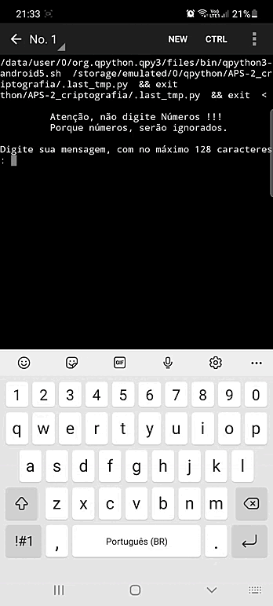

# Criptografia em Python.

### Sobre a Criptografia:

* Se o limite de 128 caracteres for ultrapassado, aparece um aviso e pedi para digitar novamente.

* O usuário pode escolher, se deseja criptografar uma nova mensagem ou não.

* Se a resposta da pergunta, for igual a não, o programa será finalizado com o efeito do sleep(1) (uma das funções do módulo time).

* Não digite Números, pois, esses serão ignorados.

* Caso, o usuário digite Sim ou Não de forma errada, ou na mensagem, apertar o enter sem digitar nada, aparece um aviso e pedi para digitar novamente.

### Um Gif dessa Criptografia:

